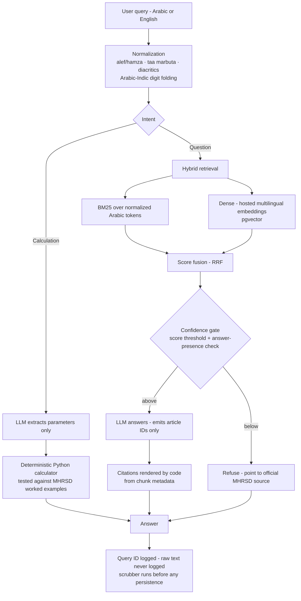

# nizam-app

**Arabic-first RAG + agent system over the Saudi Labor Law (نظام العمل).**

Ask a labor-law question in Arabic or English. The system answers **only** from the ingested authoritative Arabic text, cites the exact article behind every legal claim, refuses when retrieval confidence is low, and routes end-of-service-benefit calculations to a deterministic Python calculator — the language model never does arithmetic.

> **Not legal advice.** This is an informational tool that produces estimates from published regulations. Answers may differ by contract and circumstance. For an official position, consult the Ministry of Human Resources and Social Development (MHRSD) or a qualified lawyer.

---

## Status

**Phase 1, in progress. Nothing is deployed yet.** This is the honest build state, not a list of intentions.

| | Component | State |
|---|---|---|
| 1 | Golden eval set (~80 questions, labeled) | not started |
| 2 | Corpus ingestion + article-level chunking | not started |
| 3 | Hybrid retrieval (BM25 + dense) | not started |
| 4 | Cite-or-refuse answer layer | not started |
| 5 | End-of-service calculator + tests | not started |
| 6 | PDPL logging + PII scrubber | not started |
| 7 | Evals in CI | not started |
| 8 | AWS deploy behind a domain | not started |

Phase 1 ships to a small group of named testers, not the public. Public launch is Phase 2, gated on all eight rows being green.

---

## Why this problem

Saudi Labor Law was materially amended by Royal Decree **M/44**, effective **February 2025**. Much of the Arabic-language web — including law-firm blog posts, and the pre-amendment knowledge baked into LLM training data — is now **wrong**. Article 75 notice periods became asymmetric; the probation ceiling moved. A general-purpose chatbot answering from memory will confidently state repealed rules.

That makes this a good test case for the real engineering problem: **grounding a generative system in a regulated corpus tightly enough that you would put your name on any answer it produces.**

The design bar throughout is the **screenshot test** — every answer the system can emit must be one I am comfortable seeing screenshotted, in public, under my real name. Conservative refusal thresholds are a feature, not a limitation.

---

## Architecture

### Five rules the code enforces

1. **The LLM never does arithmetic.** Every number — benefit amounts, service durations, accruals — is computed in tested Python. The model's only jobs are classifying intent and extracting parameters.
2. **Citations are rendered by code, not generated by the model.** The model emits article IDs; application code renders the citation string from chunk metadata. A model-authored citation is a bug, because a fluent model will invent a plausible article number.
3. **Cite or refuse.** Every legal claim carries an article citation. Below the confidence gate the system refuses with a pointer to the official source — a helpful redirect, never a bare "I can't help."
4. **No legal logic from memory.** No formula or article summary is written from recall, by human or model. Everything derives from the ingested current text, cross-checked against official MHRSD material. Pre-amendment training knowledge is presumed wrong.
5. **Out-of-scope topics are refused by name.** GOSI/social insurance, the Implementing Regulations, domestic workers' regulation, immigration/iqama, Qiwa procedures, and pre-amendment law each get a named refusal identifying the correct authority. The common trap is a benefits question entangled with GOSI; there is a dedicated eval case for it.

---

## Corpus

**Primary authority:** the consolidated Arabic Labor Law from the Bureau of Experts (`laws.boe.gov.sa`), incorporating M/44. This is the only source cited *as law*.

**Secondary:** scoped official MHRSD FAQ pages — end-of-service, resignation/termination, notice, probation, annual leave. Labeled as such, cited as "MHRSD guidance," never as law. Their main purpose is serving as an answer key for the eval set.

Roughly 245 short articles plus a bounded FAQ set — small enough that I have read the entire corpus. For a legal tool that is a requirement, not a nice-to-have.

**Licensing:** a review of the BOE terms of use, and of how Saudi open-government-data licensing applies to republishing answers grounded in the law text, is **pending**. The finding gets recorded here either way, before anything is served publicly.

**Chunking:** one article, one chunk, via a parser written for this document's structure rather than a generic recursive splitter. Legal text has a native unit and citations must resolve to it; character-window chunking would split articles mid-clause and make citation resolution ambiguous. Chunk metadata carries `article_no`, part/chapter title, `amended_by_m44`, `source_url`, and separate retrieval and display text.

---

## Retrieval

**Sparse:** in-process BM25 (`rank_bm25`) over custom-normalized Arabic tokens. PostgreSQL full-text search has no serious Arabic stemmer, and at sub-1k chunks an in-process index costs nothing.

**Dense:** a hosted multilingual embedding API into pgvector. Self-hosting an embedding model on a 2 GB instance is not viable, and the corpus is far too small to justify a dedicated vector database — pgvector in the same Postgres means one backup story and one instance to operate. A dedicated vector DB is a migration story for a later version, if the corpus ever justifies it.

The choice between candidate embedding models is settled by **benchmarking both on the golden set**, not by leaderboard reputation. Both result tables stay in the repo, including the loser's.

**Normalization** is a shared module: alef/hamza variant folding, taa marbuta, diacritic stripping, and Arabic-Indic digit folding (٠–٩ → ASCII). The BM25 tokenizer and the PII scrubber both depend on it. Digit folding runs **before** any PII regex — otherwise the regexes silently miss numbers typed in Arabic-Indic digits, which is how a large share of Saudi users actually type.

---

## Evaluation

**The golden set is built before the pipeline.** Not as discipline theater: if I cannot write the questions users actually ask, the corpus choice is wrong, and that should surface in week one rather than after building retrieval for it.

~80 questions with per-question provenance, committed to the repo:

| Slice | ≈n | Measures |
|---|---|---|
| Answerable Q&A with labeled gold article IDs | 35 | recall@5, MRR, LLM-judge answer grade |
| Calculator questions with exact expected numbers | 15 | exact match — no judge involved |
| Refusal-required (GOSI entanglement, domestic workers, iqama, pre-amendment, active disputes) | 20 | refusal recall |
| Arabic/English paired duplicates | 10 | language-parity gap across all metrics |

**Over-refusal is measured from day one.** The 35 answerable questions double as the over-refusal denominator, because a system tuned only for refusal precision degrades into one that refuses everything and feels broken.

**The LLM judge scores exactly three things:** is the answer grounded in the retrieved text, is the citation correct, are there fabricated numbers. Narrow rubrics survive scrutiny; a holistic 1–5 "quality" score does not. Every judge disagreement gets a human spot-check.

English-into-an-Arabic-corpus retrieval is expected to start worse. The parity slice makes that a number instead of a vibe.

**In CI:** retrieval metrics and calculator exact-match run on every PR (cheap, no judge). The full judge run is nightly, plus any PR touching prompts, retrieval, or ingestion. Per-commit metrics JSON is published to a results branch so regressions are diffable. Hard thresholds fail the build.

---

## End-of-service benefit calculator

Phase 1's only tool. Inputs: last monthly wage, service **start and end dates** (the system does the date math — never ask users to compute their own service duration), and termination type — employer termination, resignation, contract expiry, mutual agreement, or the Article 80/81 cases.

Output: the amount, the step-by-step formula, the specific articles relied on, and explicit framing as an estimate rather than a settlement figure. Exclusions are surfaced *with* the result rather than buried: GOSI, the treatment of commissions and allowances, and contractual enhancements above the statutory floor.

Tests cover MHRSD worked examples where published, plus the adversarial cases — resignation under two years of service, fractional years, and wage changes shortly before termination, which are out of scope and where the system says so instead of guessing.

Every calculator-relevant article is verified against the ingested current text before any formula ships.

---

## Privacy (PDPL)

**Scrub before storage. Raw query text exists only in the request lifecycle.**

1. **In-flight** — the raw query lives in memory for retrieval and answering. Application logs record a **query ID, never query text**.
2. **Quarantine** — raw queries, encrypted, in a short-lived table with automatic purge at 24–72h. Purpose: debugging fresh failures.
3. **Analytics** — reachable only through the scrubber. 90-day retention, then aggregates only.

The scrubber runs in order: Arabic-Indic digit normalization first, then deterministic regexes (Saudi phone formats, 10-digit national ID and iqama patterns, emails, SA-prefixed IBANs), then name redaction via a cheap batch LLM pass at the quarantine-to-analytics promotion. Batch redaction costs pennies at this volume and beats hosting an Arabic NER model on a 2 GB box.

Salary **amounts** are kept — the highest-value analytics signal, and non-identifying once names and identifiers are gone. Identifiers are dropped. IPs are hashed, used only for rate limiting, and never joined to query text.

A privacy notice in Arabic and English is linked from the input box rather than buried in a footer: controller identity, what is collected after redaction, purposes, retention, no sharing or selling, and a contact for rights requests. The same surface carries the not-legal-advice disclaimer.

**Cross-border note:** hosting in Bahrain constitutes a PDPL cross-border transfer. The mitigation is that what crosses is redacted, minimized, and short-retention. This is a documented engineering posture, not a legal opinion on the transfer regulations.

---

## Deployment

| Layer | Choice |
|---|---|
| Language | Python 3.12, asyncio |
| API | FastAPI |
| Storage | PostgreSQL + pgvector, single instance |
| Frontend | one server-rendered page |
| Host | AWS me-south-1 (Bahrain), 1× EC2 t4g.small |
| Runtime | Docker Compose — app · Postgres · Caddy for TLS |
| CI/CD | GitHub Actions → build images → deploy via **AWS SSM** |
| Secrets | SSM Parameter Store |
| Monitoring | CloudWatch alarms · structured JSON logs · analytics table in Postgres · minimal admin page |

Bahrain is the closest AWS region; there is no KSA region at time of writing. Deploys go through **SSM, so the instance has no open SSH port** and CI holds no long-lived server credentials.

**Cost governance is a product feature, not an afterthought.** Per-IP-hash token-bucket rate limiting plus a global daily query cap, with a graceful "daily capacity reached" state instead of a failure. The project runs under a hard monthly ceiling, which is what makes an abuse-driven bill an engineering problem worth solving visibly.

---

## Scope, deliberately

**v1 claims exactly this:** deterministic calculator tools plus a cite-or-refuse policy. Nothing more.

A multi-step retrieval planner and a cross-document comparator are deferred. Both would let me use the word "agentic" more aggressively, and neither is needed to answer the questions users actually ask. Claim less; defend all of it.

Also deferred: additional calculators, the Implementing Regulations, other regulators' corpora, and a heavier frontend.

---

## Author

Yazan Alkamal — AI Engineer, Saudi Arabia.

## License

To be determined alongside the corpus licensing review. Until then, all rights reserved.
